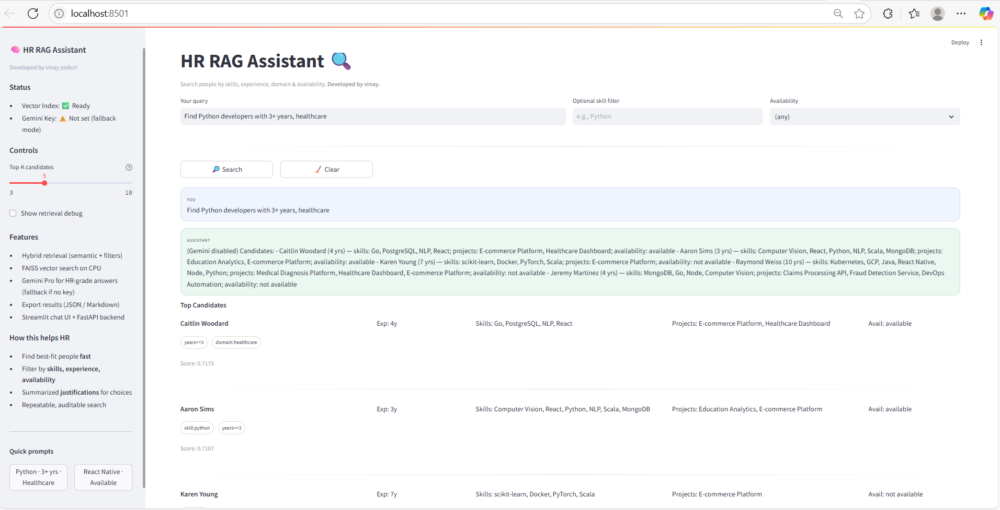
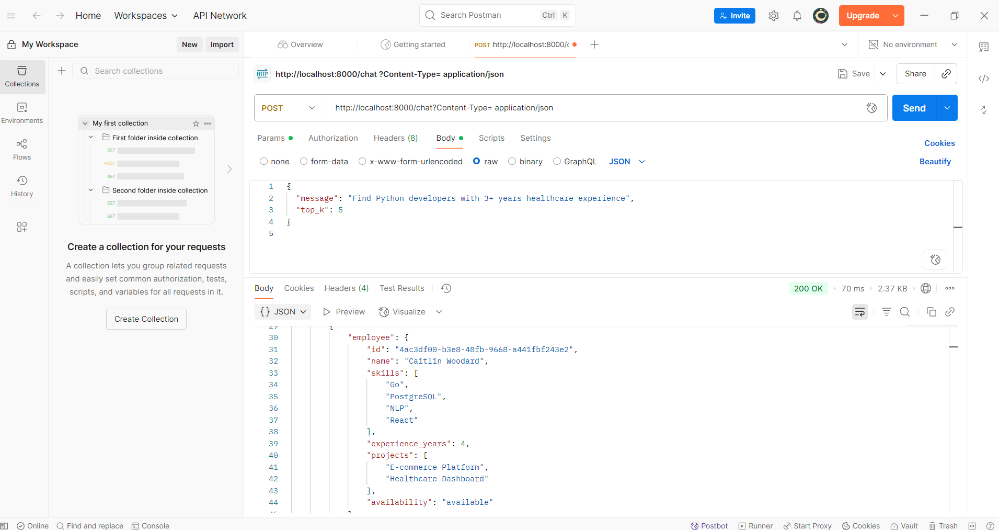

# HR Resource Query Chatbot (RAG) — FastAPI + FAISS + SentenceTransformers + Gemini Pro

> **Developed by Vinay **  
> Find the right people fast with hybrid retrieval (semantic + constraints) and LLM-quality HR recommendations.



---

## TL;DR (Run in 2 minutes)

```bash
# 0) clone
git clone https://github.com/<your-username>/hr-rag-bot.gitS
cd hr-rag-bot

# 1) venv + install
python -m venv .venv
# Windows
.venv\Scripts\activate
# macOS/Linux
# source .venv/bin/activate

pip install --upgrade pip
pip install -r requirements.txt

# 2) env
cp .env.example .env
# open .env and set GEMINI_API_KEY=your_google_generative_ai_key

# 3) data + index
python -m scripts.generate_data
python -m scripts.build_index   # use -m so Python finds the local `rag/` package

# 4A) API server (Swagger at /docs)
uvicorn api.main:app --reload --port 8000

# 4B) Streamlit UI (optional)
# in another terminal, same venv
streamlit run app_streamlit.py
```

---

## Why this is legit (for reviewers)

- **Hybrid Retrieval**: FAISS dense vectors (cosine) + lightweight lexical/constraint re-rank (skills, years, availability, domain hints)  
- **LLM Generation**: Gemini Pro crafts concise HR-grade recommendations; safe fallback when key is absent  
- **Modular RAG**: Embeddings, vector store, retriever, generator, pipeline are cleanly separated for scalability  
- **Two Entry Points**: 
  - REST API via **FastAPI** (`/chat`, `/employees/search`)
  - **Streamlit** chat UI for demos and non-tech stakeholders  
- **Synthetic but Realistic Data**: Faker generates a 15–20 person pool with diverse skills and domains  
- **Docs & Debuggability**: Swagger, sidebar status, optional retrieval debug, export to JSON/Markdown

---

## Architecture

```
Client (Streamlit) / Client (Postman) / Any HTTP Client
        │
        └──► FastAPI  ──►  RAG Pipeline
                       ├─► Retriever: FAISS dense search + rule bumps (skills/years/domain/availability)
                       ├─► Generator: Gemini Pro (fallback template if no key)
                       └─► Response: answer + ranked candidates + debug

Data:
  data/employee_data.json (Faker)
  data/index.faiss        (FAISS IP index with normalized vectors)
  data/meta.json          (vec_id ↔ employee, retrievable text)
```

**Tech Stack**: FastAPI, Streamlit, FAISS, sentence-transformers (`all-MiniLM-L6-v2`), google-generativeai (Gemini), Pydantic v2

---

## Screenshots

- **Streamlit demo**  
  `docs/streamlit_ui.png`

- **Postman proof**  
  `docs/postman_api.png`



---

## Project Structure

```
hr-rag-bot/
├─ .env.example
├─ README.md
├─ requirements.txt
├─ run_api.sh
├─ run_streamlit.sh
├─ data/
│  ├─ employee_data.json            # generated by scripts/generate_data.py
│  ├─ index.faiss                   # built by scripts/build_index.py
│  └─ meta.json                     # id -> employee mapping + text fields
├─ rag/
│  ├─ __init__.py
│  ├─ config.py          # env, paths, constants
│  ├─ models.py          # Pydantic schemas
│  ├─ embedding.py       # model loading + encode
│  ├─ store.py           # FAISS + metadata access
│  ├─ retriever.py       # hybrid retrieval + scoring
│  ├─ generator.py       # Gemini Pro prompt + fallback
│  └─ pipeline.py        # orchestrates RAG
├─ api/
│  └─ main.py            # FastAPI endpoints
├─ app_streamlit.py      # polished UI
└─ scripts/
   ├─ generate_data.py   # Faker dataset
   └─ build_index.py     # build FAISS + meta
```

> ⚠️ Don’t `pip install rag`. Our `rag/` is **local code**, not a PyPI package.

---

## Detailed Setup (from scratch)

### 1) Prerequisites
- Python 3.10+  
- Internet access for pip + model download  
- A Google Generative AI key (optional for LLM generation): https://ai.google.dev/

### 2) Clone & install

```bash
git clone https://github.com/<your-username>/hr-rag-bot.git
cd hr-rag-bot
python -m venv .venv
# Win
.venv\Scripts\activate
# macOS/Linux
# source .venv/bin/activate
pip install --upgrade pip
pip install -r requirements.txt
```

### 3) Configure environment

```bash
cp .env.example .env
# Edit .env:
# GEMINI_API_KEY=your_google_generative_ai_key
```

If you skip the key, the app still works with a **clean fallback** (no API calls).

### 4) Generate data & build index

```bash
python -m scripts.generate_data   # creates data/employee_data.json
python -m scripts.build_index     # builds data/index.faiss + data/meta.json
```

*(Using `-m` ensures Python finds the local `rag/` package.)*

### 5A) Run the API

```bash
uvicorn api.main:app --reload --port 8000
# Swagger: http://localhost:8000/docs
# Health:  http://localhost:8000/health
```

### 5B) Run the Streamlit app

```bash
streamlit run app_streamlit.py
# UI: http://localhost:8501
```

---

## API Documentation

### `POST /chat`
**Body**
```json
{
  "message": "Find Python developers with 3+ years healthcare experience",
  "top_k": 5
}
```

**Response**
```json
{
  "answer": "...LLM or fallback text...",
  "results": [
    {
      "employee": {
        "id": "uuid",
        "name": "Alice Johnson",
        "skills": ["Python","AWS","React"],
        "experience_years": 5,
        "projects": ["Healthcare Dashboard","E-commerce Platform"],
        "availability": "available"
      },
      "score": 0.91,
      "reasons": ["skill:python","years>=3","domain:healthcare"]
    }
  ],
  "used_hybrid": true,
  "debug": {
    "parsed_query": {"years":3,"skills":["python"],"availability":null,"domain":"healthcare"},
    "raw_hits": 12
  }
}
```

### `GET /employees/search`
**Query Params**: `skill`, `min_years`, `availability`  
**Example**:
```
GET /employees/search?skill=python&min_years=3&availability=available
```

---

## Streamlit UI (what to demo)

- **Sidebar**: 
  - *Status* — Vector index ready? Gemini key present?  
  - *Controls* — Top-K slider, retrieval debug toggle  
  - *Features/How it helps* — quick bullets for stakeholders  
  - *Quick prompts* — one-click example queries
- **Main**:
  - Query box + optional filters (skill/availability)  
  - Chat-style bubbles (you + assistant)  
  [200~# Candidate cards with score and justification tags  
  - Export buttons (Markdown & JSON)

---

## RAG Pipeline Details

1. **Embedding**: SentenceTransformers `all-MiniLM-L6-v2`  
2. **Vector DB**: FAISS IP index with normalized embeddings (cosine similarity)  
3. **Hybrid Scoring**:  
   - Base dense similarity  
   - +0.05 per matching skill in query  
   - +0.07 if experience ≥ requested years  
   - +0.06 if domain (e.g., *healthcare*) matches projects  
   - +0.05 if availability matches  
4. **Generation**: Gemini Pro with structured prompt → concise HR recommendation  
   - Fallback: formatted candidate bullets when no API key is set

---

## AI Development Process (what I used & why)

- **Assistants**: ChatGPT for architecture review + scaffolding; manual refactors for retrieval scoring & packaging  
- **AI-written vs manual**: ~60% scaffold; ~40% hand-tuned (retriever scoring, prompt shaping, error handling)  
- **What AI helped**: module boundaries, prompt template variants, quick boilerplate  
- **What needed manual craft**: hybrid scoring logic, clean Pydantic models, Streamlit UX polish, Windows import edge cases  
- **Guardrails**: Gemini key is optional; runtime status visible; deterministic fallback path

---

## Technical Decisions & Trade-offs

- **Open-source embeddings + FAISS (CPU)** for speed and cost  
- **Gemini Pro** for high-quality reasoning text (optional)  
- **FastAPI** for proper REST & Swagger; **Streamlit** for demo speed  
- **Hybrid retrieval** beats pure dense for HR queries (constraints matter)  
- **Trade-offs**: full-text BM25 not added to keep footprint small (see Future)

---

## Future Improvements

- Add **BM25** lexical retriever (e.g., `rank_bm25`) and fuse with dense hits  
- Normalize skills via ontology (map aliases, e.g., *tf* → *TensorFlow*)  
- Multi-vector per employee (skills vs projects as separate entries)  
- Caching LLM answers with query fingerprints  
- Auth, audit logging, PII redaction for real HR data

---

## Troubleshooting

**`ModuleNotFoundError: No module named 'rag'` when running scripts**  
→ Run from project root with `-m`:
```bash
python -m scripts.generate_data
python -m scripts.build_index
```

**Tried `pip install rag` and got Django errors**  
→ Don’t do that. Our `rag/` is local code, not a PyPI package.

**FAISS errors on Windows**  
→ Use the pinned `faiss-cpu` wheel in `requirements.txt`. Make sure Python is 3.10+.

**Gemini disabled in answer**  
→ Set `GEMINI_API_KEY` in `.env`. Otherwise fallback formatting is used (still fine for demo).

---


---

## Credits

- **Built by Vinay **  
- SentenceTransformers, FAISS, FastAPI, Streamlit, Google Generative AI
